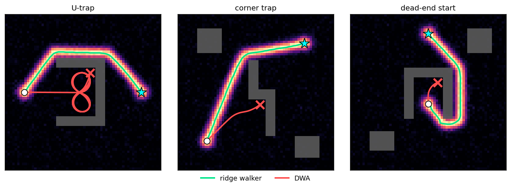
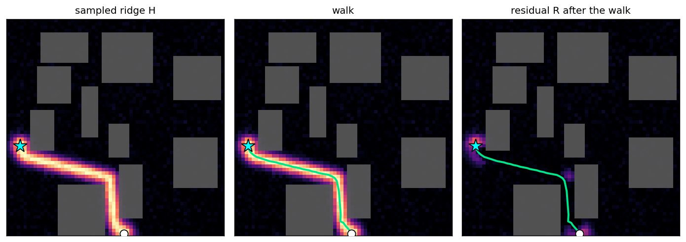
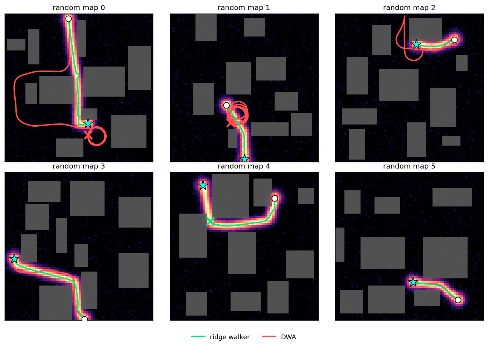

# RidgeFlow

**A DWA with nothing to tune.** A flow-matching model paints a ridge over the map in one shot.
A dynamic-window walker then follows it. The walker has no goal term, no cost weights and no
constants to tune. Because it follows a route drawn over the whole map, it gets out of dead
ends that trap a classic DWA.

<p align="center"></p>

The same maps given to a classic DWA (red). DWA only knows the direction to the goal, so it
drives into the pocket and circles there. The walker (green) follows the route the model drew.

## Method

The model takes an occupancy grid and two endpoints and returns a heatmap `H`: a Gaussian ridge
of width σ<sub>H</sub> laid along a feasible route. It is trained with rectified flow on RRT*
demonstrations and sampled in 4 steps.

The walker is a DWA whose objective is the ridge itself. It keeps a residual `R`, which starts
as `H`. Each step it fans candidates `c` over the half-plane ahead, drops those whose segment
hits an obstacle (the feasible set `F`), and moves to the candidate that explains the most
remaining energy. It then subtracts its own footprint:

```math
x_{k+1} = \arg\max_{c \in F_k} \langle R_k, \Phi_c \rangle,
\qquad
R_{k+1} = \max\left(R_k - a\,\Phi_{x_{k+1}},\ 0\right),
\qquad
\Phi_c(z) = \exp\left(-\frac{\lVert z - c \rVert^2}{2\sigma_H^2}\right)
```

Ridge the walker has already covered stops attracting it, so the energy left ahead sets the
direction. There is no goal term and nothing to oscillate back to. Once the goal is within one
step and the segment to it is free, the walker connects to the goal.

<p align="center"></p>

Every constant comes from the model or the grid:

| constant | value | from |
|---|---|---|
| footprint σ | σ<sub>H</sub> = 1.5 px | the ridge width the model was trained on |
| amplitude `a` | δ / (σ√(2π)) | atoms one step apart add up to exactly a unit ridge |
| step δ | 1 px | the grid |
| cone | ±90° | never step backwards |
| window | ⌈σ√(2 ln 10³) + ½⌉ = 7 | truncation error below 0.1% |

## Random maps

1000 maps drawn from the training distribution (7 to 10 boxes, straight line blocked). Both
planners avoid the same raster, padded by one cell.

| method | weights to tune | success |
|---|---|---|
| **ridge walker** | **none** | **94.6%** |
| DWA, best of 60 settings | heading, clearance, speed, horizon | 38.2% |

The walker's candidates, collision filter and argmax are those of a DWA. The only change is the
objective: DWA scores the direction to the goal, clearance and speed, and the weights between
them decide whether it works at all. The walker scores the ridge energy it would explain, and
that energy already encodes a route around the obstacles. It fails in two ways, in roughly
equal numbers. Either the sampled ridge is broken and the walker wanders once the energy runs
out, or the ridge runs too close to a wall and every candidate ahead is blocked.

<p align="center"></p>

DWA's result depends heavily on its weights. We searched 60 settings on 100 held-out maps and
the benchmark uses the best one. A selection:

| heading | clearance | speed | horizon | success |
|---|---|---|---|---|
| 0.08 | 0.30 | 3.0 | 0.6 s | **53%** |
| 0.03 | 0.10 | 1.0 | 0.6 s | 51% |
| 0.15 | 0.10 | 1.0 | 1.0 s | 31% |
| 0.15 | 0.03 | 1.0 | 1.0 s | 20% |
| 0.15 | 0.10 | 1.0 | 2.0 s | 18% |
| 0.50 | 0.10 | 1.0 | 1.0 s | 5% |
| | | | worst of 60 | 0% |

## Run

```bash
pip install -e .
python examples/demo.py       # the figures above
python examples/benchmark.py  # the table above
```
