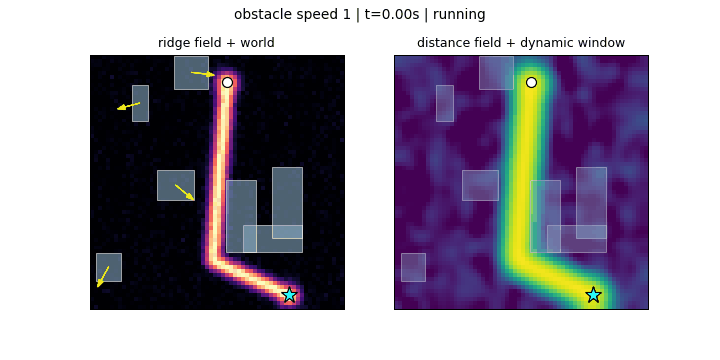

# RidgeFlow Dynamic

A zero-tuning dynamic navigator. A flow-matching model paints a ridge over the map, and a
dynamic-window controller follows it while the obstacles move.

<p align="center">
  <br>
  <em>Left: the sampled ridge field. Right: the distance field with the dynamic window
  coloured by score.</em>
</p>

## How it works

Given an occupancy grid and two endpoints, the model samples a heatmap — a Gaussian ridge of
width `sigma` laid along a feasible route:

```
H(x) = exp(-d(x, route)^2 / 2 sigma^2)
```

That is an encoded distance field, so it inverts:

```
d(x)^2 = -2 sigma_eff^2 log H(x)
```

The controller descends `d^2`. That is the whole objective — there is no goal-attraction
weight, no obstacle-repulsion weight, no velocity term to tune. Obstacle avoidance is not a
score term at all: infeasible candidates are removed by a hard collision filter before
anything is scored.

## What "dynamic" means here

Three things run on independent clocks:

- **the world** — obstacles are moving boxes that bounce off the walls and steer around the
  robot rather than driving through it;
- **the controller**, at `control_hz` — each cycle it enumerates turns crossed with speeds
  `(+1, 0, -0.5)`, so it can rotate in place and reverse out of a dead end;
- **the guidance**, at `guidance_hz` — the model only ever sees a frozen snapshot, so the
  replanning rate is what keeps its picture current. Each replan is anchored where the robot
  *will be*, not where it is.

## Install

```bash
git clone https://github.com/Rin-Li/rigeflow_dynamic.git
cd rigeflow_dynamic
pip install -e .
```

A GPU is optional; `device="cpu"` works. `checkpoints/ridgeflow_rrt64.pt` ships a 12.7M
parameter model trained on RRT* demonstrations at 64x64.

## Use

```bash
python examples/01_single_episode.py
python examples/02_record_gif.py --obstacle-speed 2
python examples/03_speed_benchmark.py
python examples/04_train.py --dataset path/to/data.npy
```

```python
import numpy as np
from ridgeflow import FlowMatchingGuidance, GridSpec, SimulationConfig, run_episode, sample_pocket_world

grid = GridSpec(size=64, extent=8.0)
guidance = FlowMatchingGuidance("checkpoints/ridgeflow_rrt64.pt", grid)
world = sample_pocket_world(np.random.default_rng(0), grid, speed=2.0)

result = run_episode(world, guidance, SimulationConfig(guidance_hz=16))
print(result.outcome, result.path_length)
```

## Training

Rectified flow on the straight path `x_t = (1-t) x0 + t eps`, where `x0` is the rendered
ridge. The model regresses the constant velocity `eps - x0`, which is what makes few-step
sampling viable. The dataset is a pickled dict of `map`, `start`, `goal` and `paths`; ridge
targets are rendered on the fly.

```python
from ridgeflow import GridSpec
from ridgeflow.training import RidgeDataset, TrainConfig, train

train(RidgeDataset("data/train.npy", GridSpec()), TrainConfig(output_dir="checkpoints/run"))
```

## Layout

```
src/ridgeflow/
  grid.py         world <-> pixel coordinates
  world.py        moving rectangles, rasterisation, collision
  scenarios.py    world samplers
  field.py        ridge heatmap -> distance field
  unet.py         the conditional UNet
  flow.py         rectified flow: interpolation and sampler
  targets.py      Gaussian endpoint and path-tube rendering
  guidance.py     Guidance protocol; FlowMatchingGuidance
  walker.py       the dynamic window and its objective
  simulation.py   the episode loop
  render.py       gif output
  training/       dataset and trainer
```

`Guidance` is a `Protocol`, so anything with a `heatmap(occupancy, start, goal, seed)` method
can drive the controller.

## License

MIT
