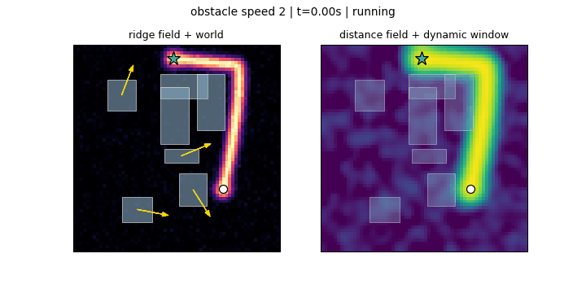

# RidgeFlow Dynamic

**A zero-tuning dynamic navigator: a flow-matching model paints a ridge over the map, and a
dynamic-window controller descends it.**

There is no cost-function weight to tune. The controller's objective is a single term — stay
on the ridge — and every number below comes from the same defaults in
[`WalkerConfig`](src/ridgeflow/walker.py). No goal-attraction weight, no obstacle-repulsion
weight, no velocity bonus, no per-scenario retuning.

<p align="center">
  <br>
  <em>Obstacles at the robot's own speed. Left: the sampled ridge field. Right: the inverted
  distance field with the dynamic window coloured by score.</em>
</p>

## The idea

Classical DWA scores each candidate velocity with a hand-weighted sum of heading, clearance
and velocity terms. Those weights are what makes it fragile: they trade off goal-seeking
against obstacle avoidance, and the right trade-off depends on the map.

Here a conditional generative model does the global reasoning instead. Given an occupancy
grid and two endpoints it samples a heatmap `H`, a Gaussian ridge of width `sigma` laid along
a feasible route:

```
H(x) = exp(-d(x, route)^2 / 2 sigma^2)
```

`H` is an encoded distance field, so it inverts exactly:

```
d(x)^2 = -2 sigma_eff^2 log H(x)
```

The controller descends `d^2`. That is the entire objective. Obstacle avoidance is not a
score term at all — infeasible candidates are removed by a hard collision filter before
scoring, so collision freedom is constructive rather than traded off against progress.

Two properties matter. The quadratic well pulls harder the further off-route the robot is,
unlike the ridge itself whose gradient decays as `exp(-d^2/2 sigma^2)`; and the field is peak
normalised, so a mis-calibrated heatmap amplitude does not drag the robot off it.

## Results

Pocket maps, 30 episodes per row, replanning at 16 Hz, robot speed 1.0 world units/s.
Obstacles move at a matched speed and actively avoid the robot.

| obstacle speed | relative to robot | arrived | hit | mean path length |
|---|---|---|---|---|
| 0.5 | 0.5x | **100.00%** | 0.0% | 8.08 |
| 1.0 | 1.0x | **100.00%** | 0.0% | 8.44 |
| 1.5 | 1.5x | **100.00%** | 0.0% | 8.89 |
| 2.0 | 2.0x | 96.67% | 3.3% | 8.61 |
| 3.0 | 3.0x | 86.67% | 13.3% | 7.97 |

Nothing fails until obstacles move faster than the robot, and every failure that does occur
is a collision — no episode froze, and none was boxed in. The drop is not a decline in
decision quality: at 3x an obstacle crosses the robot's own body length in the time between
two control cycles, so a fraction of the approaches cannot be evaded at any control rate.

| | | |
|---|---|---|
|  |  |  |
| obstacle speed 1.0 | obstacle speed 2.0 | obstacle speed 3.0 |

Reproduce with [`examples/03_speed_benchmark.py`](examples/03_speed_benchmark.py). Runs are
deterministic given a seed: see `latency_s` under [Notes](#notes-and-limitations).

### Where it does not hold

The same configuration on **scattered** maps — 6 to 10 boxes, all of them moving, no static
structure:

| obstacle speed | pocket | scattered |
|---|---|---|
| 0.5 | **100.00%** | 90.00% |
| 1.0 | **100.00%** | 83.33% |
| 1.5 | **100.00%** | 60.00% |
| 2.0 | 96.67% | 50.00% |
| 3.0 | 86.67% | 20.00% |

```bash
python examples/03_speed_benchmark.py --scenario scattered
```

The obvious explanation — pocket maps simply carry fewer moving boxes, 4 against 6 to 10 —
does not survive being tested. Doubling the pocket's movers costs almost nothing below 2x:

| obstacle speed | pocket, 4 movers | pocket, 8 movers | scattered |
|---|---|---|---|
| 1.0 | 100.00% | 100.00% | 83.33% |
| 1.5 | 100.00% | 96.67% | 60.00% |
| 2.0 | 96.67% | 100.00% | 50.00% |
| 3.0 | 86.67% | 76.67% | 20.00% |

```bash
python examples/03_speed_benchmark.py --movers 8
```

So box count accounts for at most ~10 points, and only at 3x. The rest of the gap is the
layout itself: the pocket's three static walls are cover the robot spends much of the episode
beside, which limits the directions a box can arrive from, and scattered boxes are larger
(0.5 to 2.4 world units per side, against 0.5 to 1.4 for the pocket's movers). Neither
column is the "real" difficulty — they bracket it.

The reported numbers are all with live replanning, and `guidance_hz=0` does not give a
meaningful ablation baseline. The distance field has a steep gradient *across* the ridge and
none *along* it — every point on the route is equally on it — so with `goal_weight=0` nothing
scores progress. Direction comes entirely from re-anchoring each replanned field ahead of the
robot, as described below. Handed a single never-updated field, the controller stalls: the
sampled field's bright start cap sits under the robot, making standing still strictly optimal.
Zero tuning and a stale-field baseline are not simultaneously available.

## What "dynamic" means here

Three things move, on three independent clocks.

**The world.** Every obstacle is an axis-aligned box with a constant-speed velocity that
bounces off the boundary. Boxes additionally apply a social-force repulsion: within
`avoid_radius` of the robot they bend their heading away from it while keeping their speed,
the way a person walks around something rather than through it. Blind obstacles make the
setting hopeless at any realistic speed, which measures the obstacle model rather than the
planner. A reserved bay around the goal keeps a drifting box from sealing the destination
and losing an episode the planner never had a chance at.

**The controller,** at `control_hz` (default 16 Hz). Each cycle it enumerates the dynamic
window — the product of 21 turn angles across a 75-degree cone with speeds `(+1, 0, -0.5)` —
rejects candidates whose swept segment touches an occupied cell, and takes the best survivor.
Speed 0 rotates on the spot and negative speed reverses; without them a robot facing into a
dead end cannot get out.

**The guidance,** at `guidance_hz` (default 16 Hz). The model is handed a *frozen* occupancy
snapshot and knows nothing about velocities — it was trained on static maps. Replanning rate
is therefore the only mechanism keeping its picture of the world current, and
`EpisodeResult.staleness_px` reports how far an obstacle travels between refreshes.

Each refresh is anchored on **where the robot will be** when that field starts being used —
one refresh interval plus one inference latency ahead — not where it is now. Anchoring on the
robot itself puts the field's bright start cap directly under it, and every candidate in the
fan then sees the same value: the measured score spread collapses from 0.175 to 0.030.

A single sampler seed is held for the whole episode. Drawing a fresh one per refresh makes
the stochastic sampler propose a *different route* each cycle, so the robot chases a new plan
instead of tracking the map.

An episode ends when the robot arrives, is hit, has its own cell blocked (`trapped`), holds
position for `freeze_limit` cycles (`frozen`), or times out. Being hit counts as a failure
even when a box drove into a stationary robot.

## Install

```bash
git clone https://github.com/Rin-Li/rigeflow_dynamic.git
cd rigeflow_dynamic
pip install -e .
```

A CUDA GPU is optional; `FlowMatchingGuidance(..., device="cpu")` works and is roughly 10x
slower per sample. The shipped checkpoint `checkpoints/ridgeflow_rrt64.pt` is a 12.7M
parameter UNet trained on 8,140 RRT* demonstrations at 64x64.

## Examples

```bash
python examples/01_single_episode.py                  # one episode, printed result
python examples/02_record_gif.py --obstacle-speed 2   # write a gif to outputs/
python examples/03_speed_benchmark.py                 # the table above
python examples/04_train.py --dataset path/to/data.npy
```

The API is small enough to use directly:

```python
import numpy as np
from ridgeflow import FlowMatchingGuidance, GridSpec, SimulationConfig, run_episode, sample_pocket_world

grid = GridSpec(size=64, extent=8.0)
guidance = FlowMatchingGuidance("checkpoints/ridgeflow_rrt64.pt", grid)
world = sample_pocket_world(np.random.default_rng(0), grid, speed=2.0)

result = run_episode(world, guidance, SimulationConfig(guidance_hz=16))
print(result.outcome, result.path_length)
```

## Training

Rectified flow on the straight path `x_t = (1-t) x0 + t eps`, where `x0` is the rendered
ridge. The velocity transporting that path is the constant `eps - x0`, and the model
regresses it directly. A straight path has no curvature, which is what makes 4-step Euler
sampling viable — the shipped checkpoint is sampled at 4 steps with `eta=0.5`.

The dataset is a pickled dict with `map` (occupancy, `[x, y]`), `start`, `goal` and `paths`;
optionally `map_id` when several queries share a scene. Targets are rendered on the fly by
measuring each pixel's distance to every path *segment*, so supervision does not depend on
how densely the demonstrator sampled its path.

```python
from ridgeflow import GridSpec
from ridgeflow.training import RidgeDataset, TrainConfig, train

dataset = RidgeDataset("data/train.npy", GridSpec())
train(dataset, TrainConfig(output_dir="checkpoints/run", epochs=300))
```

## Layout

```
src/ridgeflow/
  grid.py         GridSpec: the one place world and pixel coordinates are related
  world.py        Rect, World: motion, conservative rasterisation, collision
  scenarios.py    pocket and scattered world samplers
  field.py        ridge heatmap -> squared distance field, bilinear sampling
  unet.py         the conditional UNet
  flow.py         rectified flow: interpolation and the Euler sampler
  targets.py      Gaussian endpoint and path-tube rendering
  guidance.py     Guidance protocol; FlowMatchingGuidance loads a checkpoint
  walker.py       RidgeWalker: the dynamic window and its single-term objective
  simulation.py   the three-clock episode loop
  benchmark.py    outcome aggregation
  render.py       two-panel gif
  training/       dataset and trainer
```

`Guidance` is a `Protocol`, so any object with a `heatmap(occupancy, start, goal, seed)`
method can drive the controller — useful for testing without a GPU, or for swapping in a
different global planner.

## Notes and limitations

- `SimulationConfig.latency_s` is the inference delay the lookahead assumes, fixed at 11 ms
  so a benchmark is reproducible from its seed alone. Setting it to `None` uses the running
  mean the guidance actually measures, which is physically faithful but makes results depend
  on machine timing — two runs of the same seed then diverge, because a sub-millisecond shift
  in the anchor changes the sampled field and the episode is chaotic.
- The model was trained at `start_goal_sigma=1.5`; inference uses 2.0, which is what the
  reported numbers use. It is exposed as `FlowMatchingGuidance(endpoint_sigma=...)`.
- Collision is defined by the raster the planner is shown, not by the exact rectangles. The
  raster is conservative, so the two must agree or the robot can stand in a cell the planner
  calls blocked and every candidate gets rejected.
- Only the pocket layout is validated. Wall-with-door and multi-room layouts are outside the
  training distribution for this checkpoint — the sampled ridge is frequently disconnected —
  and are deliberately not included.
- The controller is greedy with a forward cone. It handles a single pocket because it can
  reverse, but it has no global search to retreat to and will not solve a maze.

## License

MIT
